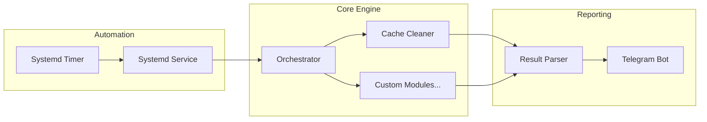

# Hygiene-Core

<div align="center">
  
  
  
  <br>
  
  
  <br>
  
</div>

<br>

<div align="center">
  
</div>

<br>

<p align="center">
  <a href="#english">🇺🇸 EN</a> | <a href="#turkish">🇹🇷 TR</a>
</p>

<a name="english"></a>

## 🇺🇸 EN

### ⚙️ System Architecture



**Hygiene-Core** is a modular, lightweight maintenance engine designed for Arch Linux. It automates manual cleanup tasks, optimizes system storage, and sends aesthetic reports via Telegram.

<div align="left">
  
</div>

#### ✨ Features

- **Modular Design:** Each task is an independent plugin in `modules/`.
- **Telegram Integration:** Instant reporting of cleaned space.
- **Safety First:** Includes `Dry Run` mode and `lsof` checks to protect active files.
- **Idle Execution:** Runs via Systemd with idle priority to ensure zero UX impact.

#### 🛡️ Dry Run Mode

By default, Hygiene-Core is shipped with `dry_run: true` in `config.yaml`. In this mode, the engine will scan the system, calculate the potential clean up size, and send the Telegram report, **but it will not permanently delete any files**.
To execute the actual cleanup process, edit the configuration:

```yaml
# config.yaml
dry_run: false
```

#### 🚀 Quick Start

```bash
git clone [https://github.com/cybalp/Hygiene-Core](https://github.com/cybalp/Hygiene-Core)
cd Hygiene-Core
python -m venv venv && source venv/bin/activate
pip install -r requirements.txt
cp .env-example .env # Add your Telegram credentials
```

## 🛠 Module Writing Guide

Add a `.py` file to `modules/`. The orchestrator will auto-discover it.

```python
class MyCustomModule:
    def __init__(self, config):
        self.config = config
    def run(self):
        return {"module": "Name", "status": "Success", "cleaned_mb": 10.0}
```

---

## 🇹🇷 TR

### ⚙️ Sistem Mimarisi

**Hygiene-Core**, Arch Linux sistemleri için tasarlanmış, modüler ve hafif bir bakım motorudur. Manuel temizlik işlerini otomatize eder, depolamayı optimize eder ve sonuçları Telegram üzerinden raporlar.

<div align="left">
  
</div>

#### ✨ Özellikler

- **Modüler Tasarım:** Her temizlik görevi `modules/` altında bağımsız bir eklentidir.
- **Telegram Entegrasyonu:** Temizlenen alan miktarını anında raporlar.
- **Güvenlik:** `Dry Run` modu ve `lsof` kontrolü ile aktif dosyaları korur.
- **Düşük Öncelikli Çalışma:** Systemd üzerinden `idle` modunda çalışarak sistem performansını etkilemez.

#### 🛡️ Dry Run Modu

Varsayılan olarak Hygiene-Core, `config.yaml` dosyasında `dry_run: true` korumasıyla gelir. Bu modda sistem taranır, potansiyel olarak silinebilecek dosya boyutu hesaplanır ve Telegram'a rapor gönderilir, **ancak hiçbir dosya fiziksel olarak silinmez**.
Sistemi gerçekten temizlemek (silme işlemlerini onaylamak) için yapılandırmayı değiştirin:

```yaml
# config.yaml
dry_run: false
```

<a name="turkish"></a>

#### 🚀 Hızlı Başlangıç

```bash
git clone [https://github.com/cybalp/Hygiene-Core](https://github.com/cybalp/Hygiene-Core)
cd Hygiene-Core
python -m venv venv && source venv/bin/activate
pip install -r requirements.txt
cp .env-example .env # Telegram bilgilerini girin
```

---

## 🛠 Modül Yazım Kılavuzu

`modules/` dizinine bir `.py` dosyası ekleyin. Orchestrator onu otomatik olarak keşfedecektir.

```python
class MyCustomModule:
    def __init__(self, config):
        self.config = config
    def run(self):
        return {"module": "Name", "status": "Success", "cleaned_mb": 10.0}
```

---

<!--SUPPORTS-->

<h1 align="center">ꜱᴜᴘᴘᴏʀᴛꜱ ᴍᴇ ∞ ♡</h1>
<p align="center">
  <a href="https://github.com/sponsors/cybalp"></a>
</p>
<p align="center">
<a href="https://www.buymeacoffee.com/cybalpxb"></a>
</p>
<br>
<p align="center">
  
  <br>
  <code align="center">TKPTZj988cNC8vPwcexPz8mfrCzYtT7Gkq</code>
  <p align="center">USDT (TRC20)</p>
</p>
